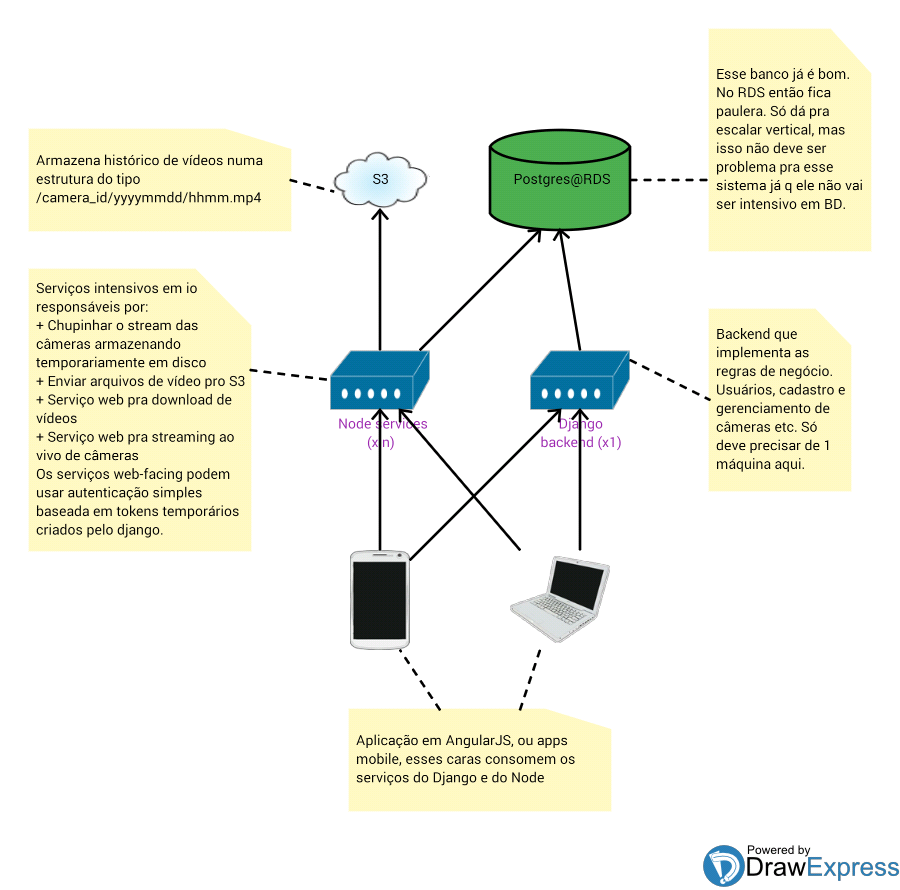
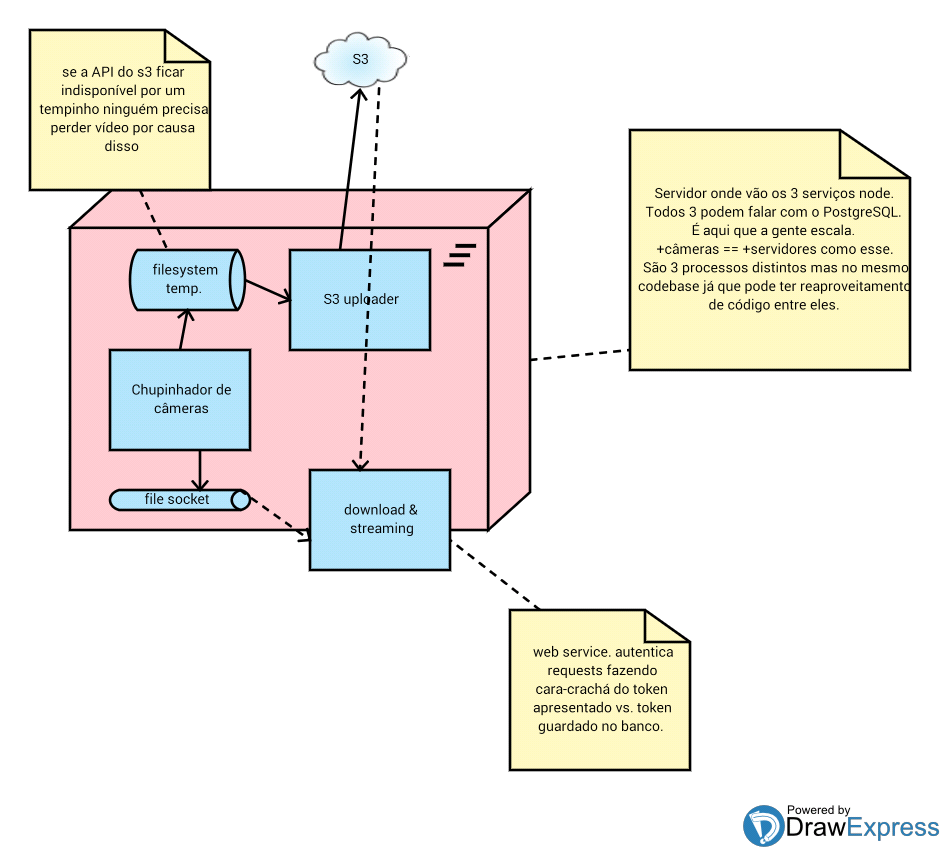
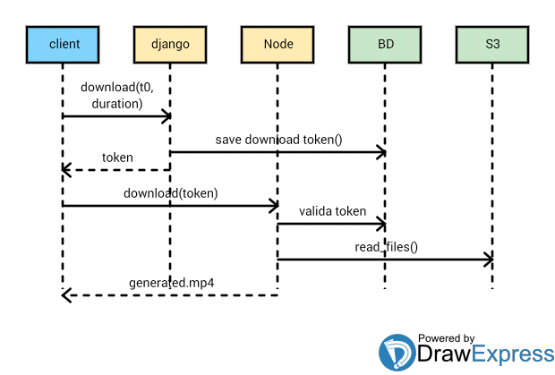

# Visão da Arquitetura do Cloudcam

O Cloudcam é um serviço cloud de armazenamento, download, e streaming de videos provenientes de câmeras de vigilância.

Esse documento é uma plano-versão-1 de como deverá se parecer a arquitetura do sistema. Não tem problema se o plano mudar depois, mas é bom não deixar isso aqui *muito desatualizado* pra não confundir ninguém.

* Vídeos ficam armazenados no S3 da amazon
* Tem um banco Postgres pra armezenar as informações pertinentes ao sistema de informação. Esse banco fica no RDS da amazon
* O backend que implementa as regras de negócio é uma aplicação Django
* Os serviços que mexem com vídeo (intensivos em io) ficam em servidores separados e são implementados em nodejs.
* O gargalo desse sistema são os serviços node. O hardware dedicado a esses serviços deverá ser proporcional à quantidade de câmeras sendo monitoradas.
* O cliente pode ser uma aplicação AngularJS ou um App mobile, e ele sabe falar com esses 2 backends.

Figura 1. Visão geral da arquitetura.

Existem 3 serviços node principais:

* **Download & streaming**: Uma aplicação em expressjs que serve pra fazer download de arquivos de video ou pra streaming de feeds live
* **Chupinhador de cameras** (putz... tem que arrumar um nome melhor pra esse cara hein!): Um programa node standalone (ou seja, não-acessível, sem api web) que fica chupinhando dados de câmeras e salvando em disco
* **S3 uploader**: Um programa standalone que consome os arquivos gerados pelo chupinhador: manda pro S3 e deleta do disco.

Figura 2. Componentes node.

Os diagramas de sequência abaixo dão uma idéia dos 2 caminhos possíveis pelos quais o cliente pode obter vídeos.

### Download de video do passado

Figura 3. Download de vídeo.

### Live feed

Figura 4. Live feed
